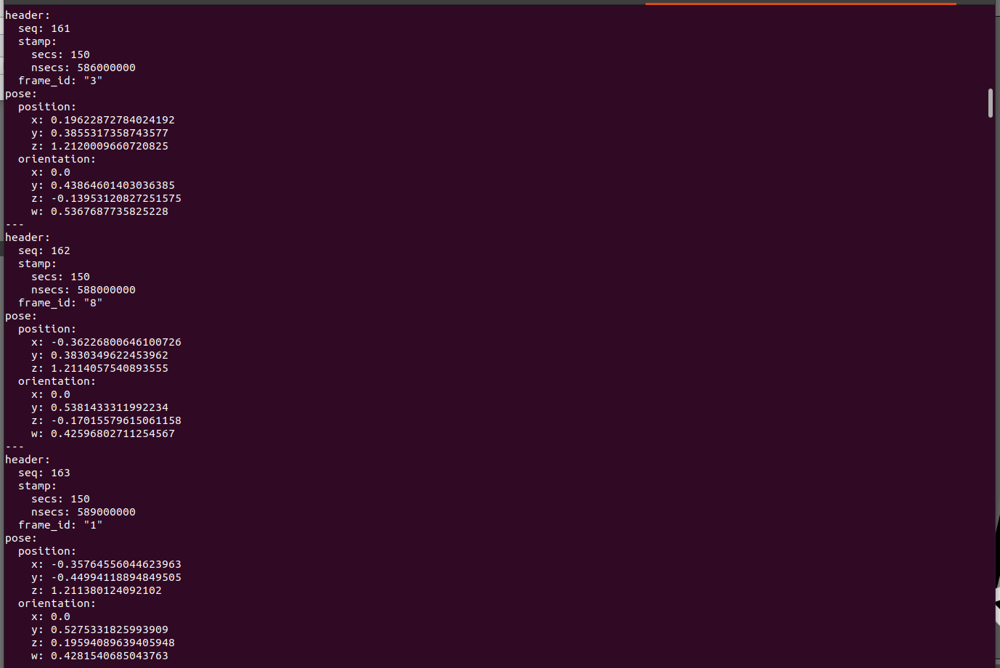
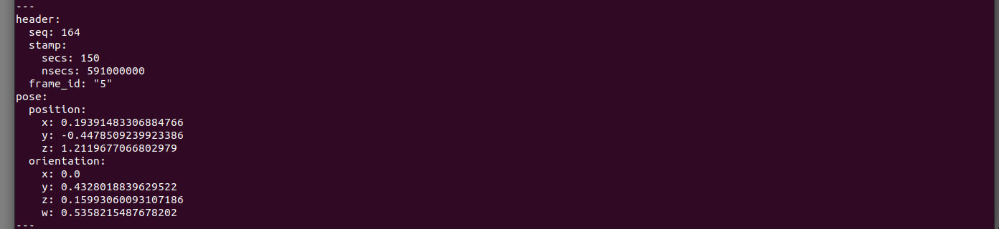

# Robotic-Manipulator-Simulation-Workspace

## Overview
Welcome to the Robotic Manipulator Simulation Workspace. This repository features diverse simulations for the robotic manipulator aimed at accomplishing ERC-24 tasks and missions. This workspace contains a simulation for robot arm based on two modes:

## Table of Contents
- [Features](#features)
- [Prerequisites](#prerequisites)
- [Installation](#installation)
- [Results](#results)
- [Notes](#notes)

## Features
- **Teleoperation Mode**: Which we control the arm in the simulation using a joystick and the motion is done with inverse kinematics with MoveIt.
- **Autonomous Mode**: Vision-based control enabling autonomous operation. We get the poseStamp that we need to move to from the camera and then do some transformations to move the arm to that position.


## Prerequisites
Before you can run the simulation, make sure you have the following software and libraries installed: 

-**ROS (Robot Operating System)** Required for robotic control.

-**MoveIt** Motion planning framework for robotics.

-**Python 3.8+** Programming language used for scripting.

-**OpenCV** Library for computer vision tasks (required for autonomous mode).

-**Gazebo**  Robot simulation environment (optional but recommended for testing).

## Installation

1. **Install ROS**:
    Follow the instructions on the [official ROS installation page](http://wiki.ros.org/ROS/Installation) to set up your ROS environment.

2. **Install MoveIt**:
    You can install MoveIt by following the [MoveIt installation instructions](https://moveit.ros.org/install/).

3. **Install Python Dependencies**:
    ```bash
    pip install -r requirements.txt
    ```

4. **Clone the Repository**:
    ```bash
    git clone https://github.com/yourusername/robotarm_simulation.git
    cd robotarm_simulation
    ```

5. **Download Yolo**:
    ```sh 
    The steps are described well in yolo ./yolov5_num_detection/YoloV5/Yolo_README.md
    ```

6. **Build the Workspace**:
    ```bash
    catkin_make
    source devel/setup.bash
    ```

7. **Launch the launch file of Vision Based Mode**:

    ```bash
    roslaunch _pkg_name number_detection.launch 
    and if the master is not launched use 
    roslaunch _pkg_name number_detection.launch run_world:=true  
    (or)
    roslaunch _pkg_name arm_urdf.launch
    ```

## Results
We have two things to check. if the topic **/point_poses** is subscribing using.

```sh
rostopic echo /point_poses
```
or we can publish the required number to publish the possible combinations on topic **/choosen_pose_stamp**.

```bash
rostopic echo /choosen_pose_stamp
```



## Notes
- After Running the camera pipeline we have to wait the local cloning of YoloV5 before we check the echo from the topic. 

- We can now subscribe from the topic **/point_poses** or we can publish the required number through the GUI 
and then subscribe from the topic **/choosen_pose_stamp**.

- We can't publish from the GUI when it opens directely we have to wait for one or two minutes. it can be handeled to avoid the wait process through editing the launch file but I'm too lazy right now.
