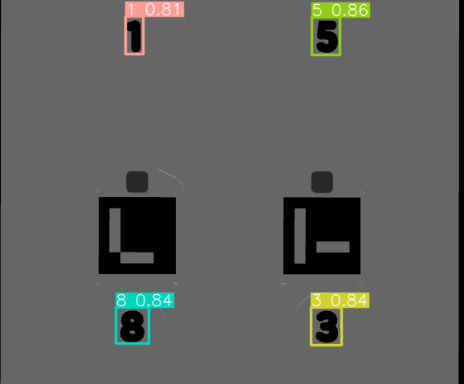
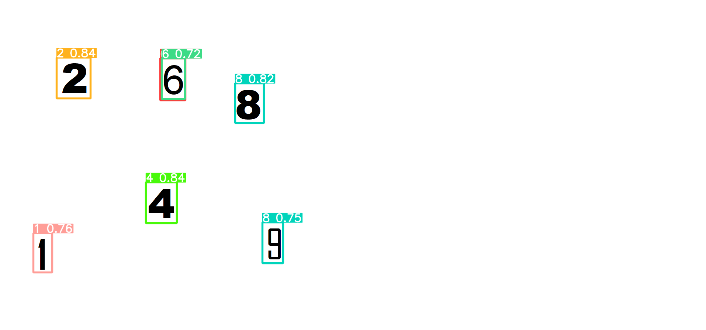

# YoloV5 Number Detection

## Overview
This project uses YoloV5 to detect numbers based on a custom dataset named `odo_digits-7`. This model can accurately detect and classify digits in various applications. The dataset can be accessed from the following link:

[Odo Digits Dataset](https://universe.roboflow.com/digits-6q2i9/odo_digits)

## Table of Contents
- [Prerequisites](#prerequisites)
- [Installation](#installation)
- [Dataset](#dataset)
- [Training](#training)
- [Inference](#inference)
- [Results](#results)
- [Conclusion](#conclusion)

## Prerequisites

Before setting up YoloV5, ensure your system meets the following requirements and has the necessary software installed:

- **Operating System**: Ubuntu 18.04 or later / Windows 10
- **Python**: Version 3.8 or later
- **CUDA**: Version 10.1 or later (for GPU support). Could also use kaggle or google colab
- **PyTorch**: Version 1.7 or later
- **pip**: Python package installer

#### Install Python and pip

1. **Ubuntu:**
   ```bash
   sudo apt update
   sudo apt install python3 python3-pip
    ```
## Installation

To get started with this project, you need to have YoloV5 and its dependencies installed. Follow these steps to set up the environment:

1. **Clone the YoloV5 Repository**
   ```bash
   git clone https://github.com/ultralytics/yolov5.git
   cd yolov5
    ```
2. **Install YoloV5 dependencies**
    ```sh
    pip install -r requirements.txt
    ```

## Dataset 
We have used in our detection application custom dataset (odo_digits-7). if you have cloned this pretrained repo no need to download the dataset only if you want to retrain it

1. **Dataset Structure**
```bash
/data
  /odo_digits-7
    /images
      /train
      /val
      /test
    /labels
      /train
      /val
      /test
```

2. **Dataset YAML File**

```bash
path: ../data/odo_digits-7
train: images/train
val: images/val

nc: 10
names: ['0', '1', '2', '3', '4', '5', '6', '7', '8', '9']
```

## Training
Now the steps to train a Yolo Model based on custom dataset assuming we have downloaded the dataset. but first we have to download the weights to decide which version i would use
1. **Download YoloV5 Weights**
```bash

from utils.downloads import attempt_download

p5 = ['n', 's', 'm', 'l', 'x']  # P5 models
cls = [f'{x}-seg' for x in p5]  # segmentation models

for x in cls:
    attempt_download(f'{HOME}/yolov5/weights/yolov5{x}.pt')
```
2. **Train Command for custom dataset (if needed)**

```sh
!python train.py --img 416 --batch 16 --epochs 5 --data (dataset_data_file).yaml  --weights ./yolov5/weights/yolov5m-seg.pt  --cache
```
the output from this is best.pt file in runs/train file we then use this file to detect even from photo or stream

## Inference
After we have got the best.pt from the training. we use the below.
```bash 
python detect.py --weights runs/train/exp/weights/best.pt --img 640 --conf 0.25 --source path_to_your_test_images
```
or we can use the file BB&C.ipynb. to detect the number and get the bouding box coordinates of each one and the label of the detected numbers

## Results 

1. **Simulator Tested Result**

2. **Random Image Tested Result**


## Conclusion 

We could see small level of confidance. in my case i haven't faced any problems with it till now. but it needs more hypertuning to get higher CF levels for the testing